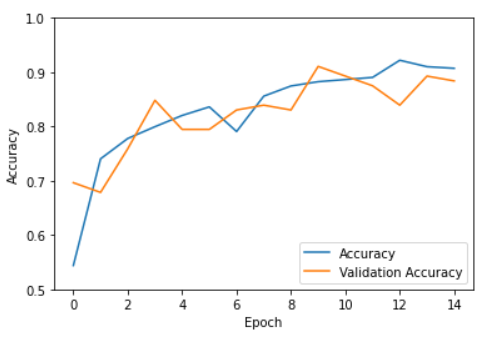

# Visionary


Visionary is a framework of machine learning (ML) tools, allowing anyone to create custom computer vision datasets and object localisation systems (OLS). Come with a folder of images, leave with a neural network!

## Introduction

Computer vision is a field of AI, allowing computers to derive information from images. Object localisation is a subset of computer vision, where computers detect the location of some, target object.


### *Such as myself!*

## Tools

Each Visionary tool is its own [Jupyter Notebook](https://jupyter.org/), a type of [Python](https://www.python.org/downloads/) file that allows block-by-block code execution. 

- 2D Dataset Generator: Create a computer vision dataset from a folder of images. Each image is labelled with coordinates, representing the target object's center.

- 4D Dataset Generator: Create a computer vision dataset from a folder of images. Each image is labelled with coordinates, representing a box around the target object.

- CNN Trainer: Create an OLS from a computer vision dataset. More specifically, a [Convolutional Neural Network](https://en.wikipedia.org/wiki/Convolutional_neural_network) (CNN) learns how to find the target object.

- Feature Map Visualiser: Observe how your OLS "sees" some image, by visualising the data at each processing step.

- Prediction Generator: Evaluate your OLS's performance by visualising its prediction for some file.

## Setup

Python and Jupyter Notebook is required to open and execute Visionary tools. Several packages are also required for machine learning, data manipulation and plotting. To use Visionary, you must:

1. Install [Python](https://www.python.org/downloads/).
2. Install OpenCV, Tensorflow and Keras for Python, by entering the following in your terminal:
```
pip install opencv-python
pip install tensorflow
pip install keras
```
3. Install [Jupyter Notebook](https://jupyter.org/). This should install the rest of Visionary's packages.
4. Download this repository.

Now, you can use Jupyter Notebook and to execute any Visionary tool.

## Instructions

Read how to use each Visionary tool, to create the OLS of your dreams!

### 2D Dataset Generator

1. Create a folder containing every image you want your dataset to contain. Move this folder to the same directory as [2D Dataset Generator.ipynb](2D%20Dataset%20Generator.ipynb).

2. Open 2D Dataset Generator.ipynb in Jupyter Notebook, and execute all blocks of code (fast-forward button).

3. Code block [6] will ask you to input the name of your dataset's folder.


4. The first image of your dataset will appear in a separate window. Click the center of your target object to label that image. 


5. The next image will appear. Repeat for every image in the dataset.

6. Once every image has been labelled, your dataset will be saved to [Dataset.csv](Dataset.csv).

### 4D Dataset Generator

This tools follows a similar process to the 2D Dataset generator, but every image is laballed with a box around the target object.

1. First, for each image, click the top-left corner of the target object.


2. Once every image has been labelled with a top-left point, the images will repeat. For each image, click the bottom-right corner of the target object.


3. Once every image has been labelled with two points, your dataset will be saved to Dataset.csv.

### CNN Trainer

1. Create a dataset with the 2D or 4D dataset generators.

2. Open [CNN Trainer.ipynb](CNN%20Trainer.ipynb) in Jupyter Notebook, and execute all blocks of code (fast-forward button).

3. Code block [10] will ask you how many epochs you want to train the neural network for. In each epoch, the AI will look at every image in the training dataset exactly once.


4. Wait for the OLS to train. This can take between minutes and days, depending on the size of the dataset and number of epochs.

5. Once the OLS is trained, your model will be saved to the folder [Model].

6. A graph is displayed showing the OLS's accuracy over time.


7. The OLS's predictions for a random set of test images (images it hasn't seen before) are displayed. Hopefully, your system did well!


### Feature Map Visualiser

1. Create an OLS with the CNN trainer.

2. Open [Feature Map Visualiser.ipynb](Feature%20Map%20Visualiser.ipynb) in Jupyter Notebook, and execute all blocks of code (fast-forward button).

3. Code block [12] will ask you how many feature maps you want to view, per layer of the OLS.


4. A random, test image is taken and passed through the OLS. The data, as it passes through the OLS, is displayed.


### Prediction Generator

1. Create an OLS with the CNN trainer.

2. Open [Prediction Generator.ipynb](Prediction%20Generator.ipynb) in Jupyter Notebook, and execute all blocks of code (fast-forward button).

3. Code block [3] will ask you to select a file for the OLS to make a prediction on.


4. The OLS makes a prediction on the selected file. This prediction is displayed.

